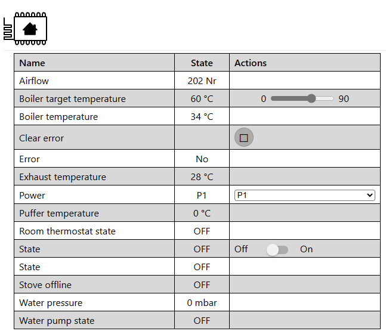

# 4Heat for ESPHome

This is a custom ESPHome integration for interfacing Tiemme 4Heat controllers.

### Usage

Simply add this to your config:

```yaml
external_components:
  source: github://leoshusar/4heat-esphome
```

And configure your components. You can also skip directly to the [configuration example](example.yaml).

### Sections

- [Custom variable types](#custom-variable-types)
- [4Heat response data](#4heat-response-data)
- [Custom parsers](#custom-parsers)
- [Datapoints](#datapoints)
- [4Heat hardware](#4heat-hardware)
- [ESPHome hardware](#esphome-hardware)
- [Config example](#config-example)
- [Official 4Heat WiFi module](#official-4heat-wifi-module)

### Available components:

- [FourHeat Component](#fourheat-component)
- [FourHeat Binary Sensor](#fourheat-binary-sensor)
- [FourHeat Button](#fourheat-button)
- [FourHeat Climate](#fourheat-climate)
- [FourHeat Number](#fourheat-number)
- [FourHeat Select](#fourheat-select)
- [FourHeat Sensor](#fourheat-sensor)
- [FourHeat Switch](#fourheat-switch)
- [FourHeat Text Sensor](#fourheat-text-sensor)

### Custom variable types

- **datapoint**: 4Heat controller datapoint ID.
  - String
  - Must be exactly 6 characters long
  - First character is usually a letter (not enforced)
    - **A**: Query read/write datapoint
    - **B**: Command to - and response from read/write datapoint
    - **I**: Query readonly datapoint
    - **J**: Response from readonly datapoint
  - The rest are 5 numbers (not enforced)
- **data**: Data to send to the provided datapoint.
  - String
  - Must be at most 12 characters long (if shorter, the data will be padded left with `'0'`)
    - For example `data: '1'` will send `{'0', '0', '0', '0', '0', '0', '0', '0', '0', '0', '0', '1'}`

### 4Heat response data

I made the response parsing quite strict. If the parsing fails, it will log a warning and ignore the received value.

Currently only `bool` and `int` parsing is supported, because I haven't seen any other data types (yet).

- **bool**: All bytes must be `'0'` and the last one either `'0'` or `'1'`.
- **int**: All bytes must be a digit.

Sometimes the data might look like this: `D10000SYEVO0000562`.

Someone [here](https://www.solarweb.net/forosolar/usuarios-biomasa/56621-comunicacion-rs232-modulo-wifi-4heat-tiemme.html) found that the `SYEVO` part is probably useless, so I simply strip it and work with only the part after. I have never seen this in a normal operation, the `D10000` datapoint is some diagnostic something (response to `C10000000000000000`). But keep this in mind when creating custom parsers - the received data might be only 7 characters long.

### Custom parsers

Every component supports custom data parser. You will get `std::vector<uint8_t> data` to work with, with only the data part of the received message (without the datapoint ID), and you must return a value of the correct type. If you don't want to return anything (you receive data you don't expect), return `{}` - empty `esphome::optional`.

If your parser doesn't return any value, the default one is then **not** called.

Use case example: Datapoint J40007 tells if external thermostat relay is ON or OFF. But it doesn't return boolean value 0 or 1, it returns `000000000100` if it's OFF and `000000000000` if it's ON. So I used custom parser like this:

```yaml
binary_sensor:
  - platform: fourheat
    name: Room thermostat state
    datapoint: J40007
    parser: return data[data.size() - 3] == '0';
```

This code simply checks if the 3rd last char is `'0'`.

### Datapoints

As written above, datapoints *usually* look like `XYYYYY`, where X is a letter and Y is a digit.

Components are configured using response datapoints. Query datapoint is then calculated automatically (by "decrementing" the first prefix letter by one). You can also specify your own query datapoint, which will override the calculated one.

Components like number or select are listening on both query and response datapoints. If you send a command to read/write datapoint, the controller responds immediately, but on the query datapoint. With this you will get immediate confirmation and you won't need to use optimistic mode.

### 4Heat hardware

That person [here](https://www.solarweb.net/forosolar/usuarios-biomasa/56621-comunicacion-rs232-modulo-wifi-4heat-tiemme.html) also found that there are different Tiemme controllers. Some will work with this integration, some *might* work, some **won't**, because they use Hayes AT commands.

### ESPHome hardware

You only need an ESP and an RS232 module.

My controller uses RJ 11 6P4C connector and has this pinout:
- **1** - GND
- **2** - RX
- **3** - TX
- **4** - VCC

Don't use the VCC for powering your ESP though, there is not much current and your 4Heat controller will start acting strange.

### Config example

You can find my full config in the [example.yaml](example.yaml).

I am using external room thermostat. If you want to use the internal one, you *should* be able to use `J30006` for reading room temperature (sensor component) and `B20493` for reading and setting target room temperature (number component). Or you can merge them all in the full climate component.



### Official 4Heat WiFi module

If you have the official WiFi module and want to integrate it to HA, you can use [this](https://github.com/zaubererty/homeassistant-4heat) integration (or my [fork](https://github.com/leoshusar/homeassistant-4heat) with an attempt to handle timeouts somehow).

But I recommend switching to ESPHome, if you can. Their mobile app is... not great, the WiFi module itself often timeouts, it also SENDS DATA TO THEIR AZURE CLOUD VIA UNENCRYPTED HTTP. It also doesn't report too often, only like once or twice per minute. Even if you spam the module every second, the module just responds with cached values.


## FourHeat Component

The base component which handles all UART communication. Requires [UART Bus](https://esphome.io/components/uart#uart).

Be aware that `UART0` is by default used by the `logger` component. If you want to use it for `fourheat`, you either need to disable logging into serial or change the `logger` UART to other one.

```yaml
# Example configuration entry
uart:
  tx_pin: GPIO5
  rx_pin: GPIO4
  baud_rate: 9600

fourheat:
```

To disable serial logging:

```yaml
logger:
  baud_rate: 0
```

### Configuration variables:

- **update_interval** (*Optional*, [Time](https://esphome.io/guides/configuration-types#config-time)): The interval to query all sensors. Defaults to 15s.


## FourHeat Binary sensor

The `fourheat` binary sensor platform creates a binary sensor from a fourheat component.

Requires FourHeat Component to be configured.

```yaml
binary_sensor:
  # Datapoint binary sensor
  - platform: fourheat
    name: My Binary Sensor
    datapoint: J30000
    query_datapoint: I30000
    parser: return data[data.size() - 1] != '0';

  # Offline sensor
  - platform: fourheat
    name: Module Offline Sensor
    type: module_offline
```

### Configuration variables:

- **id** (*Optional*, [ID](https://esphome.io/guides/configuration-types#config-id)): Manually specify the ID used for code generation.
- **name** (**Required**, string): The name of the binary sensor.
- **type** (*Optional*, enum): `binary_sensor` type. Defaults to `datapoint`.
  - `datapoint`: datapoint sensor.
  - `module_offline`: indicates if the 4Heat controller is offline.

### Datapoint
- **datapoint** (**Required**, [datapoint](#custom-variable-types)): The datapoint id of the binary sensor.
- **query_datapoint** (*Optional*, [datapoint](#custom-variable-types)): The query datapoint id of the binary sensor. If not specified, uses `datapoint` with prefix letter decremented by one.
- **parser** (*Optional*, [lambda](https://esphome.io/guides/automations#config-lambda)): Lambda for custom data parsing logic. Provides `std::vector<uint8_t> data` and must return `bool`.
- All other options from [Binary Sensor](https://esphome.io/components/binary_sensor/#config-binary-sensor).


## FourHeat Button

The `fourheat` button platform creates a button from a fourheat component.

Requires FourHeat Component to be configured.

Since the button platform is stateless, it doesn't query any data.

```yaml
button:
  - platform: fourheat
    name: My Button
    datapoint: J30000
    press_data: '1'
```

### Configuration variables:

- **id** (*Optional*, [ID](https://esphome.io/guides/configuration-types#config-id)): Manually specify the ID used for code generation.
- **name** (**Required**, string): The name of the button.
- **datapoint** (**Required**, [datapoint](#custom-variable-types)): The datapoint id of the button.
- **press_data** (*Optional*, [data](#custom-variable-types)): Custom data to be sent. Defaults to `'1'`.
- All other options from [Button](https://esphome.io/components/button/#config-button).


## FourHeat Climate

The `fourheat` climate platform creates a climate from a fourheat component.

Requires FourHeat Component to be configured.

Currently only heating mode is supported, just because I don't know if 4Heat supports anything with cooling.

```yaml
climate:
  - platform: fourheat
    name: My Climate
    datapoint: J30000
    current_temperature_datapoint: J30001
    target_temperature_datapoint: B20000
    query_datapoint: I30000
    query_current_temperature_datapoint: I30001
    query_target_temperature_datapoint: A20000
    on_datapoint: J30010
    off_datapoint: J30011
    on_data: '1'
    off_data: '1'
    parser: return data[data.size() - 1] != '0';
    current_temperature_parser: |-
      std::string int_str(data.begin(), data.end());
      return stoi(int_str);
    target_temperature_parser: |-
      std::string int_str(data.begin(), data.end());
      return stoi(int_str);
```

### Configuration variables:

- **id** (*Optional*, [ID](https://esphome.io/guides/configuration-types#config-id)): Manually specify the ID used for code generation.
- **name** (**Required**, string): The name of the climate device.
- **datapoint** (**Required**, [datapoint](#custom-variable-types)): The datapoint id of the active state.
- **current_temperature_datapoint** (**Required**, [datapoint](#custom-variable-types)): The datapoint id of the current temperature.
- **target_temperature_datapoint** (**Required**, [datapoint](#custom-variable-types)): The datapoint id of the target temperature.
- **query_datapoint** (*Optional*, [datapoint](#custom-variable-types)): The query datapoint id of the active state. If not specified, uses `datapoint` with prefix letter decremented by one.
- **query_current_temperature_datapoint** (*Optional*, [datapoint](#custom-variable-types)): The query datapoint id of the current temperature. If not specified, uses `current_temperature_datapoint` with prefix letter decremented by one.
- **query_target_temperature_datapoint** (*Optional*, [datapoint](#custom-variable-types)): The query datapoint id of the target temperature. If not specified, uses `target_temperature_datapoint` with prefix letter decremented by one.
- **on_datapoint** (*Optional*, [datapoint](#custom-variable-types)): The datapoint id for sending ON command.
- **off_datapoint** (*Optional*, [datapoint](#custom-variable-types)): The datapoint id for sending OFF command.
- **on_data** (*Optional*, [data](#custom-variable-types)): Custom data to be sent on ON command. Defaults to `'1'`.
- **off_data** (*Optional*, [data](#custom-variable-types)): Custom data to be sent on OFF command. Defaults to `'0'`.
- **parser** (*Optional*, [lambda](https://esphome.io/guides/automations#config-lambda)): Lambda for custom active state data parsing logic. Provides `std::vector<uint8_t> data` and must return `bool`.
- **current_temperature_parser** (*Optional*, [lambda](https://esphome.io/guides/automations#config-lambda)): Lambda for custom current temperature data parsing logic. Provides `std::vector<uint8_t> data` and must return `int`.
- **target_temperature_parser** (*Optional*, [lambda](https://esphome.io/guides/automations#config-lambda)): Lambda for custom target temperature data parsing logic. Provides `std::vector<uint8_t> data` and must return `int`.
- All other options from [Climate](https://esphome.io/components/climate/#config-climate).


## FourHeat Number

The `fourheat` number platform creates a number from a fourheat component.

Requires FourHeat Component to be configured.

```yaml
number:
  - platform: fourheat
    name: My Number
    datapoint: B20000
    query_datapoint: A20000
    min_value: 0
    max_value: 90
    step: 1
    parser: |-
      std::string int_str(data.begin(), data.end());
      return stoi(int_str);
```

### Configuration variables:

- **id** (*Optional*, [ID](https://esphome.io/guides/configuration-types#config-id)): Manually specify the ID used for code generation.
- **name** (**Required**, string): The name of the number.
- **datapoint** (**Required**, [datapoint](#custom-variable-types)): The datapoint id of the number.
- **query_datapoint** (*Optional*, [datapoint](#custom-variable-types)): The query datapoint id of the number. If not specified, uses `datapoint` with prefix letter decremented by one.
- **min_value** (*Optional*, float): The minimum value this number can be.
- **max_value** (*Optional*, float): The maximum value this number can be.
- **step** (*Optional*, float): The granularity with which the number can be set. Defaults to 1. Will be rounded.
- **parser** (*Optional*, [lambda](https://esphome.io/guides/automations#config-lambda)): Lambda for custom data parsing logic. Provides `std::vector<uint8_t> data` and must return `int`.
- All other options from [Number](https://esphome.io/components/number/#config-number).


## FourHeat Select

The `fourheat` select platform creates a select from a fourheat component.

Requires FourHeat Component to be configured.

```yaml
select:
  - platform: fourheat
    name: My Select
    datapoint: B20000
    query_datapoint: A20000
    optimistic: true
    options:
      1: "Option A"
      2: "Option B"
      3: "Option C"
    parser: |-
      std::string int_str(data.begin(), data.end());
      return stoi(int_str);
```

### Configuration variables:

- **id** (*Optional*, [ID](https://esphome.io/guides/configuration-types#config-id)): Manually specify the ID used for code generation.
- **name** (**Required**, string): The name of the select.
- **datapoint** (**Required**, [datapoint](#custom-variable-types)): The datapoint id of the select.
- **query_datapoint** (*Optional*, [datapoint](#custom-variable-types)): The query datapoint id of the select. If not specified, uses `datapoint` with prefix letter decremented by one.
- **options** (**Required**, Map[int, str]): Provide a mapping from values (int) of this select to options (str) of the datapoint and vice versa. All options and all values have to be unique.
- **optimistic** (*Optional*, boolean): Whether to operate in optimistic mode - when in this mode, any command sent to the Select will immediately update the reported state.
- **parser** (*Optional*, [lambda](https://esphome.io/guides/automations#config-lambda)): Lambda for custom data parsing logic. Provides `std::vector<uint8_t> data` and must return `int`.
- All other options from [Select](https://esphome.io/components/select/#config-select).


## FourHeat Sensor

The `fourheat` sensor platform creates a sensor from a fourheat component.

Requires FourHeat Component to be configured.

```yaml
sensor:
  - platform: fourheat
    name: My Sensor
    datapoint: J30000
    query_datapoint: I30000
    parser: |-
      std::string int_str(data.begin(), data.end());
      return stoi(int_str);
```

### Configuration variables:

- **id** (*Optional*, [ID](https://esphome.io/guides/configuration-types#config-id)): Manually specify the ID used for code generation.
- **name** (**Required**, string): The name of the sensor.
- **datapoint** (**Required**, [datapoint](#custom-variable-types)): The datapoint id of the sensor.
- **query_datapoint** (*Optional*, [datapoint](#custom-variable-types)): The query datapoint id of the sensor. If not specified, uses `datapoint` with prefix letter decremented by one.
- **parser** (*Optional*, [lambda](https://esphome.io/guides/automations#config-lambda)): Lambda for custom data parsing logic. Provides `std::vector<uint8_t> data` and must return `int`.
- All other options from [Sensor](https://esphome.io/components/sensor/#config-sensor).


## FourHeat Switch

The `fourheat` switch platform creates a switch from a fourheat component.

Requires FourHeat Component to be configured.

```yaml
switch:
  - platform: fourheat
    name: My Switch
    datapoint: J30000
    query_datapoint: I30000
    on_datapoint: J30010
    off_datapoint: J30011
    on_data: '1'
    off_data: '1'
    parser: return data[data.size() - 1] != '0';
```

### Configuration variables:

- **id** (*Optional*, [ID](https://esphome.io/guides/configuration-types#config-id)): Manually specify the ID used for code generation.
- **name** (**Required**, string): The name of the switch.
- **datapoint** (**Required**, [datapoint](#custom-variable-types)): The datapoint id of the switch.
- **query_datapoint** (*Optional*, [datapoint](#custom-variable-types)): The query datapoint id of the switch. If not specified, uses `datapoint` with prefix letter decremented by one.
- **on_datapoint** (*Optional*, [datapoint](#custom-variable-types)): The datapoint id for sending ON command.
- **off_datapoint** (*Optional*, [datapoint](#custom-variable-types)): The datapoint id for sending OFF command.
- **on_data** (*Optional*, [data](#custom-variable-types)): Custom data to be sent on ON command. Defaults to `'1'`.
- **off_data** (*Optional*, [data](#custom-variable-types)): Custom data to be sent on OFF command. Defaults to `'0'`.
- **parser** (*Optional*, [lambda](https://esphome.io/guides/automations#config-lambda)): Lambda for custom active state data parsing logic. Provides `std::vector<uint8_t> data` and must return `bool`.
- All other options from [Switch](https://esphome.io/components/switch/#config-switch).


## FourHeat Text Sensor

The `fourheat` text sensor platform creates a text sensor from a fourheat component.

Requires FourHeat Component to be configured.

```yaml
text_sensor:
  - platform: fourheat
    name: My Text Sensor
    datapoint: J30000
    query_datapoint: I30000
    options:
      1: "Option A"
      2: "Option B"
      3: "Option C"
    parser: |-
      std::string int_str(data.begin(), data.end());
      return stoi(int_str);
```

### Configuration variables:

- **id** (*Optional*, [ID](https://esphome.io/guides/configuration-types#config-id)): Manually specify the ID used for code generation.
- **name** (**Required**, string): The name of the sensor.
- **datapoint** (**Required**, [datapoint](#custom-variable-types)): The datapoint id of the sensor.
- **query_datapoint** (*Optional*, [datapoint](#custom-variable-types)): The query datapoint id of the sensor. If not specified, uses `datapoint` with prefix letter decremented by one.
- **options** (**Required**, Map[int, str]): Provide a mapping from values (int) of this select to options (str) of the datapoint and vice versa. All options have to be unique.
- **parser** (*Optional*, [lambda](https://esphome.io/guides/automations#config-lambda)): Lambda for custom data parsing logic. Provides `std::vector<uint8_t> data` and must return `int`.
- All other options from [Sensor](https://esphome.io/components/sensor/#config-sensor).

